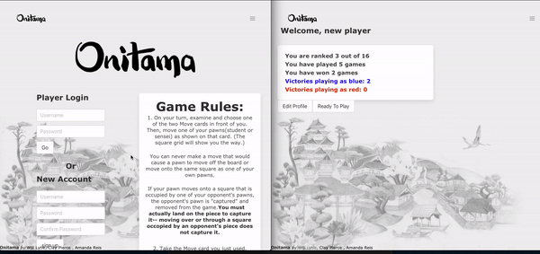
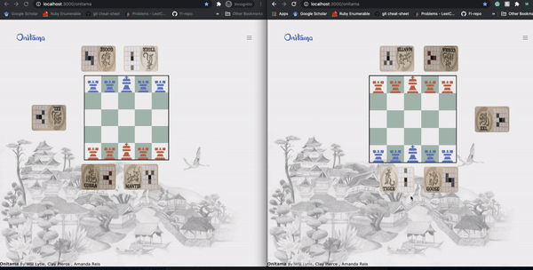

# Onitama

Onitama is a game app based on the [board game of the ame name](https://www.arcanewonders.com/resources/Onitama_Rulebook.PDF). This app was built soley for educational purposes and is not intended for comercial distribution.  

Onitama is built with a Rails back-end using Action Cable and a React front end using Webpack. 

## Requirements
* Ruby 2.6.1
* Rails 6.0.3
* React 17.0.1
* postgres 13.1

## Setting up Onitama locally

First fork and clone this repo. Install the `gem-file` and `package.json` by running `bundle install` and `yarn`. Then start a Redis server `brew services start redis` (if you need to install Redis check [here](https://tableplus.com/blog/2018/10/how-to-start-stop-restart-redis.html))

## Initializing the database

Within the project directory run `rails db:create` and `rails db: migrate`

## Launching the server

To launch the server simply run `rails s`. This will launch the game on `http://localhost:300`. Navigate there to play. Note: because Onitama uses action action cable and is played on two idfferent browser windows, if you wish to play on one computer where the game is served locally you will may need to open one of the windows in incognito mode. 

## Example of app usage and game play

## Created By

